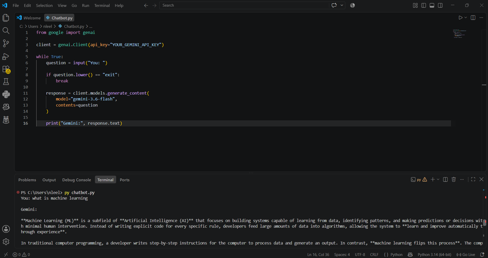
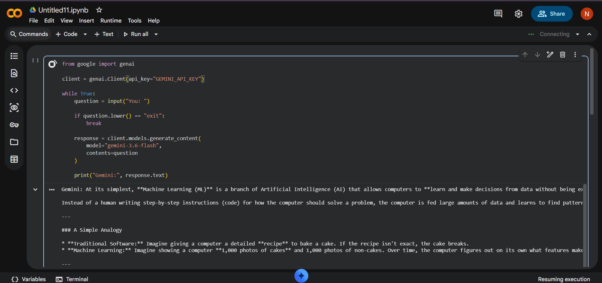

# Gemini AI Chatbot using Python

A simple AI chatbot built with **Python** and the **Google Gemini API**.

## About the Project

This project connects a Python application with the Gemini AI model through the Gemini API. Users can enter questions in the terminal and receive AI-generated responses.

## Technologies Used

* Python
* Google Gemini API
* Google GenAI SDK

## Features

* Simple command-line chatbot
* AI-generated responses
* Continuous question and answer interaction
* Exit option using `exit`
* Can be run using VS Code or Google Colab

## Screenshots

### VS Code Output



### Google Colab Output



## How to Run

Install the required package:

```bash
pip install google-genai
```

Add your Gemini API key in the Python code and run:

```bash
python main.py
```

Enter your question and the chatbot will generate a response.

## Note

Keep your **Gemini API key private** and never upload it directly to GitHub.

## Project Purpose

This mini project helped me understand how to **integrate Generative AI APIs with Python** and build a simple AI-powered application.
